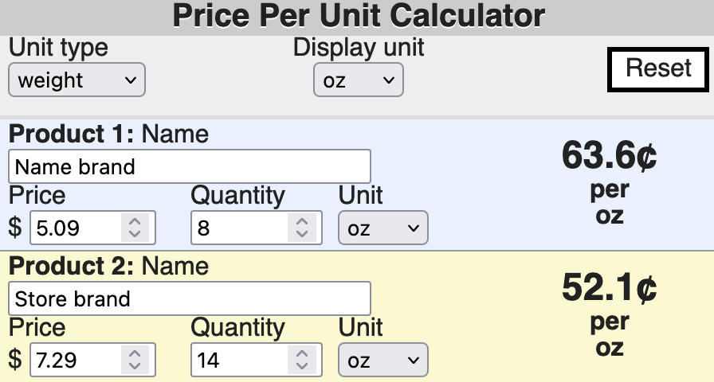

Scientific software developer in the Washington, D.C. area.

# Portfolio of my projects

## [Materials and cheminformatics Sampler](https://sampler-flask.herokuapp.com/)
*Uses Python, NumPy, SymPy, ChemPy, Flask, JavaScript, and Bootstrap*

Find a given number of points which satisfy constraints given in a constraints file for an n-dimensional space defined on the unit hypercube, then write them to an output file.

Optionally, identify the components (dimensions) in the constraints file using chemical formulas, and Sampler will use ChemPy to calculate their molar masses, then output the component weight fraction.

## [Periodic Table Navigator](https://ptablenav.herokuapp.com/)
*Uses Ruby, Sinatra, PostgreSQL, and JavaScript*

Understand how the elements are related to each other. Emphasizes electronic configuration of the elements.

## [Price Per Unit Calculator](http://www.whitegloveapps.com/priceper/priceper.html)
*Uses JavaScript*

A utility for shopping: calculate the unit price by weight, count, area, etc.

# My open-source contributions

## SymPy computer algebra system in pure Python
- Technical writer for funded 2022 Season of Docs project: Creating documentation for how to [solve equations](https://docs.sympy.org/dev/guides/solving/index.html)
- Core developer wrote "I think you are doing excellent work on the SymPy documentation. Thank you!"
- [Led selection of new Sphinx theme for SymPy documentation](https://github.com/sympy/sympy/issues/22716); the [new theme was implemented](https://docs.sympy.org/dev/)
- [Contributed code for documentation](https://github.com/sympy/sympy/pulls?q=is:pr+author:bertiewooster+is:merged) to explain usage of a core class for users and developers, and improve accessibility
- Lead developer wrote “You've been doing great work with the Sphinx theme and other documentation work”

## ChemPy package for chemistry in Python
- Initiated and provided scientific and coding direction to issue to [improve interpretation of chemical formulas](https://github.com/bjodah/chempy/issues/202)
- Spurred a developer to improve code
- Package author wrote “Great work guys!”

## Sphinx documentation generator
- Initiated issue to [improve accessibility and internationalization of documentation generated by Sphinx](https://github.com/sphinx-doc/sphinx/issues?q=author%3Abertiewooster+); was addressed within a day by Sphinx’s main developer
