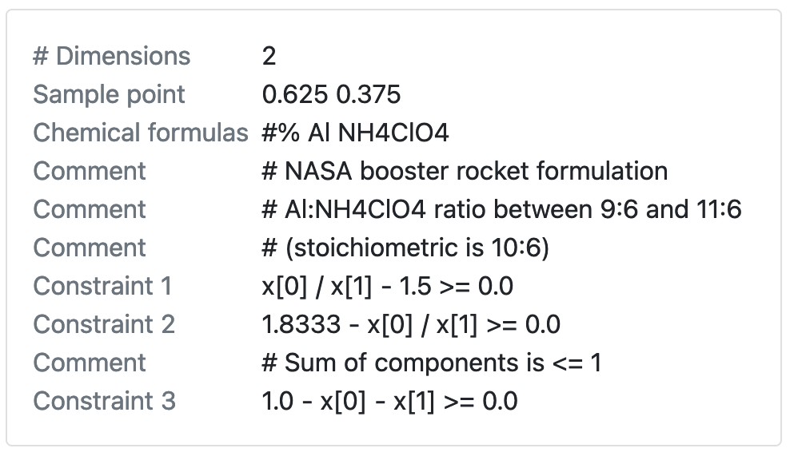

Scientific software developer in the Washington, D.C. area.

# Portfolio of my projects

## [RDKit Utility to Check Whether Starting Materials for Synthesizing Your Target Molecules Are Commercially Available]()
*Uses Python, RDKit, PubChem's API, asyncio, and Semaphore*

Given target molecules and reactions to synthesize them, determine whether the starting materials are commercially available using PubChem's API, and thus whether the target is synthetically accessible.

## [RDKit Utility to Create a Mass Spectrometry Fragmentation Tree]()
*Uses Python and RDKit*

Given a mass spec fragmentation hierarchy, with species as SMILES strings, display the fragmentation tree in a grid, labeling each species with its name and either mass or mass to charge ratio `m/z`.

## [RDKit Utility to Find the Maximum Common Substructure, and Groups Off It, Between a Set of Molecules]()
*Uses Python and RDKit*

Given a collection of molecules as SMILES strings, find the maximum common substructure (MCS) match between them, and the groups off that common core for each molecule, displaying the results using a grid.

## [Chemistry machine learning for drug discovery with DeepChem]()
*Uses Python, DeepChem, seaborn, Matplotlib, and pandas*

Use the DeepChem deep learning package to predict compounds' lipophilicity--how well they are absorbed into the lipids of biological membranes, which is important for oral delivery of drugs.

## [RDKit Utility to Visualize Retrosynthetic Analysis Hierarchically]()
*Uses Python and RDKit*

Given a target molecule, use the [Recap algorithm](https://www.semanticscholar.org/paper/RECAP-%E2%80%94-Retrosynthetic-Combinatorial-Analysis-A-New-Lewell-Judd/fbfb10d1f63aa803f6d47df6587aa0e41109f5ee){:target='_blank'} to decompose it into a set of fragments that could be combined to make the parent molecule using common reactions. Display the fragmentation hierarchically.

## [RDKit Utility to Find and Highlight the Maximum Common Substructure Amongst Molecules]()
*Uses Python and RDKit*

Given a collection of molecules as [SMILES](https://en.wikipedia.org/wiki/Simplified_molecular-input_line-entry_system){:target='_blank'} strings, find the maximum common substructure (MCS) match between them as a [SMARTS](https://en.wikipedia.org/wiki/SMILES_arbitrary_target_specification){:target='_blank'} string, display the match pattern as a molecule, and highlight the match pattern in each molecule using a grid.

## [Materials and Cheminformatics Sampler](https://sampler-flask.herokuapp.com/)
*Uses Python, NumPy, SymPy, ChemPy, Flask, JavaScript, and Bootstrap*

Find a given number of points which satisfy constraints given in a constraints file for an n-dimensional space defined on the unit hypercube, then write them to an output file.

Optionally, identify the components (dimensions) in the constraints file using chemical formulas, and Sampler will use ChemPy to calculate their molar masses, then output the component weight fraction.

## [Periodic Table Navigator](https://ptablenav.herokuapp.com/)
*Uses Ruby, Sinatra, PostgreSQL, and JavaScript*

Understand how the elements are related to each other. Emphasizes electronic configuration of the elements.

# My open-source contributions

## RDKit cheminformatics package
- [Improved documentation](https://github.com/rdkit/rdkit/pulls?q=is%3Amerged+is%3Apr+author%3Abertiewooster+) by illustrating drawing capability in tutorial and adding SMILES (chemical notation) for R groups

## SymPy computer algebra system in pure Python
- Technical writer for funded 2022 Season of Docs project: Creating documentation for how to [solve equations](https://docs.sympy.org/dev/guides/solving/index.html)
- Core developer wrote "I think you are doing excellent work on the SymPy documentation. Thank you!"
- [Led selection of new Sphinx theme for SymPy documentation](https://github.com/sympy/sympy/issues/22716); the [new theme was implemented](https://docs.sympy.org/dev/)
- [Contributed code for documentation](https://github.com/sympy/sympy/pulls?q=is:pr+author:bertiewooster+is:merged) to explain usage of a core class for users and developers, and improve accessibility
- Lead developer wrote “You've been doing great work with the Sphinx theme and other documentation work”

## ChemPy package for chemistry in Python
- Initiated and provided scientific and coding direction to issue to [improve interpretation of chemical formulas](https://github.com/bjodah/chempy/issues/202)
- Spurred a developer to improve code
- Package author wrote “Great work guys!”

## Sphinx documentation generator
- Initiated issue to [improve accessibility and internationalization of documentation generated by Sphinx](https://github.com/sphinx-doc/sphinx/issues?q=author%3Abertiewooster+); was addressed within a day by Sphinx’s main developer
