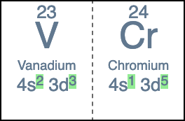

Scientific software developer in the Washington, D.C. area.

# Portfolio

- [Cheminformatics blog posts](#cheminformatics-blog-posts)
- [Web apps](#web-apps)
- [Open-source contributions](#open-source-contributions)

## Cheminformatics blog posts

### [Drawing Molecules With Indigo]()

Here's how to draw molecules with EPAM Indigo Toolkit, a free and open-source cheminformatics package.

### [How to Write Cheminformatics Blog Posts]()
As the YouTubers would say, “A lot of you have been asking me about how to write cheminformatics blog posts.” Well, not a lot, but at least a couple! Here's my process.

### [Why Some Organic Molecules Have a Color]()

It's usually because of a long chain of conjugated bonds. I search 20K data points to find a series of molecules where extending the conjugated chain increases the absorption wavelength.

### [Tautomer Generation Algorithms and InChI Representations]()

Which cheminformatics algorithms produce the most tautomers? And how successful is InChI at representing with a single representation all tautomers of a given structure?

### Molecular Isotopic Distributions: [Permutations]() and [Combinations]()

These posts use two different methods to calculate molecular isotopic mass distributions.

### [RDKit Contribution MolsMatrixToGridImage()]()

I contributed MolsMatrixToGridImage to the RDKit 2023.09.1 release to draw row-and-column grids of molecules.

### [Display Molecular Formulas]()
*Uses Python, RDKit, seaborn, and matplotlib*

How to display molecular formulas such as C3H4O2 in molecular grids, tables, and graphs. Also works for other HTML-, Markdown-, or LaTeX-formatted text. 

### [Molecular Formula Generation]()
*Uses Python and RDKit*

In cheminformatics, the typical way of representing a molecule is with a SMILES string such as `CCO` for ethanol. However, there are still cases where the molecular formula such as C2H6O is useful.

### [Refitting Data From Wiener’s Classic Cheminformatics Paper]()
*Uses Python, SciPy, Polars, NumPy, seaborn, matplotlib, and mol_frame*

How well did cheminformatics pioneers Egloff and Wiener fit their models to boiling points of alkanes in the 1940s? This blog post revisits their fits using digital tools.

### [Revisiting a Classic Cheminformatics Paper: The Wiener Index]()
*Uses Python, RDKit, Polars, matplotlib, seaborn, py2opsin, and mol_frame*

This post revisits Harry Wiener's article "Structural Determination of Paraffin Boiling Points", extracts data for molecules from it, recalculates cheminformatics parameters and boiling points, and plots the data.

### [RDKit Utility to Check Whether Starting Materials for Synthesizing Your Target Molecules Are Commercially Available]()
*Uses Python, RDKit, PubChem's API, asyncio, and Semaphore*

Given target molecules and reactions to synthesize them, determine whether the starting materials are commercially available using PubChem's API, and thus whether the target is synthetically accessible.

### [RDKit Utility to Create a Mass Spectrometry Fragmentation Tree]()
*Uses Python and RDKit*

Given a mass spec fragmentation hierarchy, with species as SMILES strings, display the fragmentation tree in a grid, labeling each species with its name and either mass or mass to charge ratio `m/z`.

### [RDKit Utility to Find the Maximum Common Substructure, and Groups Off It, Between a Set of Molecules]()
*Uses Python and RDKit*

Given a collection of molecules as SMILES strings, find the maximum common substructure (MCS) match between them, and the groups off that common core for each molecule, displaying the results using a grid.

### [Chemistry machine learning for drug discovery with DeepChem]()
*Uses Python, DeepChem, seaborn, Matplotlib, and pandas*

Use the DeepChem deep learning package to predict compounds' lipophilicity--how well they are absorbed into the lipids of biological membranes, which is important for oral delivery of drugs.

### [RDKit Utility to Visualize Retrosynthetic Analysis Hierarchically]()
*Uses Python and RDKit*

Given a target molecule, use the [Recap algorithm](https://www.semanticscholar.org/paper/RECAP-%E2%80%94-Retrosynthetic-Combinatorial-Analysis-A-New-Lewell-Judd/fbfb10d1f63aa803f6d47df6587aa0e41109f5ee){:target='_blank'} to decompose it into a set of fragments that could be combined to make the parent molecule using common reactions. Display the fragmentation hierarchically.

### [RDKit Utility to Find and Highlight the Maximum Common Substructure Amongst Molecules]()
*Uses Python and RDKit*

Given a collection of molecules as [SMILES](https://en.wikipedia.org/wiki/Simplified_molecular-input_line-entry_system){:target='_blank'} strings, find the maximum common substructure (MCS) match between them as a [SMARTS](https://en.wikipedia.org/wiki/SMILES_arbitrary_target_specification){:target='_blank'} string, display the match pattern as a molecule, and highlight the match pattern in each molecule using a grid.

## Web apps

### [Materials and Cheminformatics Sampler](https://sampler-flask.herokuapp.com/)
*Uses Python, NumPy, SymPy, ChemPy, Flask, JavaScript, and Bootstrap*

Find a given number of points which satisfy constraints given in a constraints file for an n-dimensional space defined on the unit hypercube, then write them to an output file.

Optionally, identify the components (dimensions) in the constraints file using chemical formulas, and Sampler will use ChemPy to calculate their molar masses, then output the component weight fraction.

### [Periodic Table Navigator](https://ptablenav.herokuapp.com/)
*Uses Ruby, Sinatra, PostgreSQL, and JavaScript*

Understand how the elements are related to each other. Emphasizes electronic configuration of the elements.

## Open-source contributions

### The RDKit cheminformatics package
- Conceived, proposed, and coded [MolsMatrixToGridImage](https://github.com/rdkit/rdkit/pull/6080) feature to use a two-dimensional (nested) data structure as input to create molecular grid images. Feature was merged into the main codebase by the project maintainer and released in the 2023.09.1 release. It was the subject of an [article on the site Macs In Chemistry](https://macinchem.org/2023/12/06/rdkit-molsmatrixtogridimagerdkit/), which included:

  > If you need to display molecules and associated data in a grid then Jeremy Monat’s MolsMatrixToGridImage is exactly what you need. To underline just how useful this is and to highlight how it simplifies code he has written a very [nice blog post](https://bertiewooster.github.io/2023/12/02/MolsMatrixToGridImage-simplifies-code.html).

- [Improved documentation](https://github.com/rdkit/rdkit/pulls?q=is%3Amerged+is%3Apr+author%3Abertiewooster+) by enhancing API documentation, adding to the guide for contributors, adding an example of how to include a bond index, illustrating molecular drawing capability in tutorial, adding SMILES (chemical notation) for R groups, and more

### SymPy computer algebra system in pure Python
- Technical writer for funded 2022 Season of Docs project: Creating documentation for how to [solve equations](https://docs.sympy.org/dev/guides/solving/index.html)
- Core developer wrote "I think you are doing excellent work on the SymPy documentation. Thank you!"
- [Led selection of new Sphinx theme for SymPy documentation](https://github.com/sympy/sympy/issues/22716); the [new theme was implemented](https://docs.sympy.org/dev/)
- [Contributed code for documentation](https://github.com/sympy/sympy/pulls?q=is:pr+author:bertiewooster+is:merged) to explain usage of a core class for users and developers, and improve accessibility
- Lead developer wrote “You've been doing great work with the Sphinx theme and other documentation work”

### ChemPy package for chemistry in Python
- Initiated and provided scientific and coding direction to issue to [improve interpretation of chemical formulas](https://github.com/bjodah/chempy/issues/202)
- Spurred a developer to improve code
- Package author wrote “Great work guys!”

### Sphinx documentation generator
- Initiated issue to [improve accessibility and internationalization of documentation generated by Sphinx](https://github.com/sphinx-doc/sphinx/issues?q=author%3Abertiewooster+); was addressed within a day by Sphinx’s main developer
